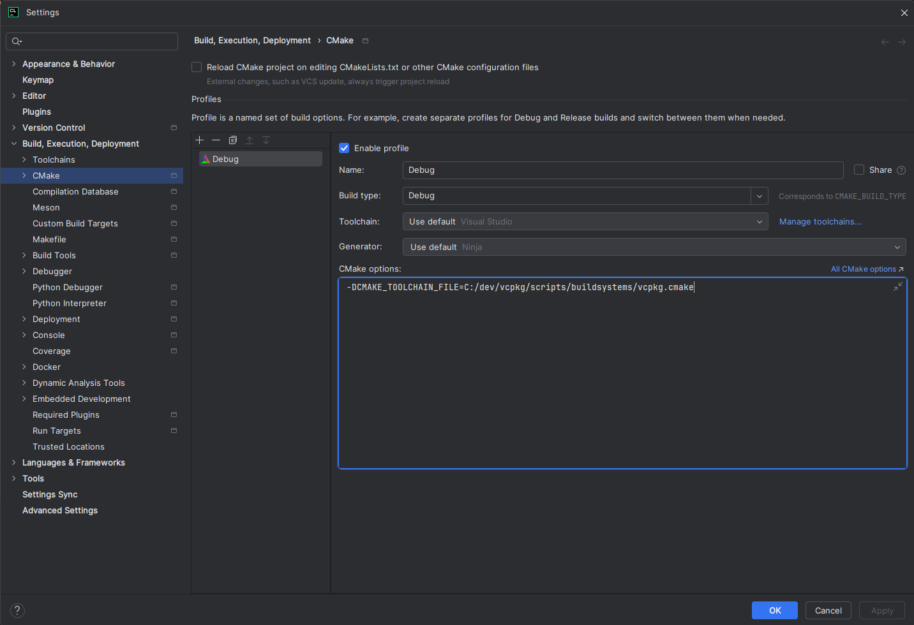
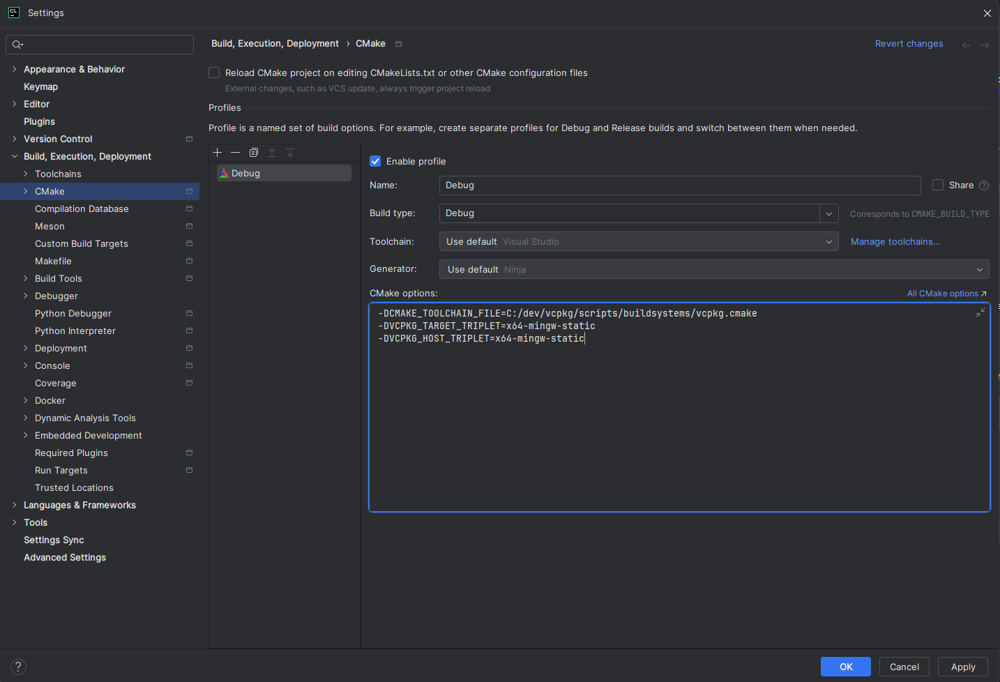

## Portfolio template

This repository contains the CMake and source template for the first part of the portfolio following the first semester of  
[AIS4104 Robitics and Intelligent Systems with Project](https://www.ntnu.edu/studies/courses/AIS4104/2024#tab=omEmnet)
at the [Master's Programme in Mechatronics and Automation (MSMECAUT)](https://www.ntnu.edu/studies/msmecaut) at NTNU in Ålesund.

### Build

The target `install_model_files` must be manually selected and built prior to the first run of the application, otherwise it will crash.

### Tasks

The tasks for the portfolio are stated by the portfolio specification document,
but they have been added to the relevant parts of the code by labels using the TODO-plugin with CLion.  
Please note that the TASK-labels may not be exhaustive, and that the portfolio specification document takes precedence on  
tasks for the portfolio submission.

To show TASK-labels in CLion, add the following pattern under Settings->Editor->TODO->Patterns.

```
\btask\b.*
```

Then, create a custom named local scope of the TODO plugin to look for tags. Name it `Tasks`, `Portfolio` or something similar. 
<p float="left">

</p>

Then, select the folders where this scope should apply (the ones highlighted in blue), and click `Include recursively`.
<p float="left">
 
</p>

Similarly, to ensure documentation and third party code are omitted, mark the respective folders and click `Exclude recursively`. 
The configuration should be color highlighted as shown below.
<p float="left">

</p>

## Tests

Unit tests have been added in the `tests`-directory and will be built automatically. They can be disabled by adding the following argument to CMake:

```
-DBUILD_TESTS=OFF
```

## VCPKG

Build using CMake and VCPKG in manifest mode by adding the following argument to CMake,

```
-DCMAKE_TOOLCHAIN_FILE=[path to vcpkg]/scripts/buildsystems/vcpkg.cmake
```

When using MinGW instead of MSVC, the following arguments (to specify vcpkg triplet) must be added,

```shell
-DVCPKG_TARGET_TRIPLET=x64-mingw-static  # Add this line when MINGW is used instead of MSVC.
-DVCPKG_HOST_TRIPLET=x64-mingw-static    # Add this line ONLY IF MSVC cannot be found. 
```

and remember to remove the comments (`# this is a comment`).

The following configuration should be used for the MSVC compiler,
<p float="left">

</p>

or the following configuration MinGW:
<p float="left">

</p>

